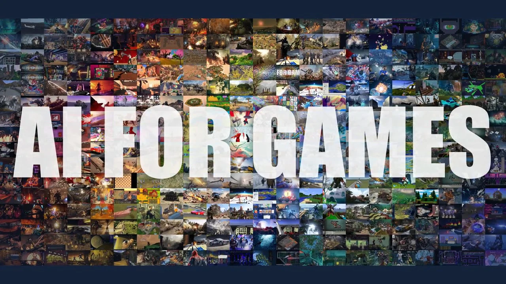
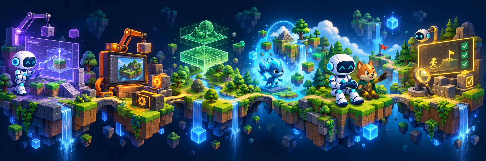
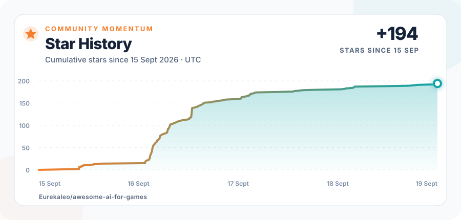

<div align="center">
  <a href="https://eurekaleo.github.io/awesome-ai-for-games/"></a>

  <p><strong><em>⭐ Star us if you find this useful!</em></strong></p>

  <a href="https://arxiv.org/pdf/2609.16679"></a>
  <a href="https://huggingface.co/papers/2609.16679"></a>
  <a href="https://eurekaleo.github.io/awesome-ai-for-games/"></a>
  <a href="https://eurekaleo.github.io/awesome-ai-for-games/#papers"></a>
  
  <a href="https://awesome.re"></a>

  <p><a href="https://eurekaleo.github.io/">Meng Luo</a><sup>1</sup> · <a href="https://liyanlin06.github.io/">Yanlin Li</a><sup>1</sup> · <a href="https://scholar.google.com/citations?user=vF-UH7oAAAAJ&amp;hl=zh-TW">Hao Li</a><sup>1</sup> · <a href="https://daniellin97.github.io/">Hongzhan Lin</a><sup>1</sup> · <a href="https://lancezpf.github.io/">Pengfei Zhou</a><sup>1</sup> · <a href="https://jometeorie.github.io/">Tianjie Ju</a><sup>1</sup><br><a href="https://openreview.net/profile?id=~Ran_Zhang18">Ran Zhang</a><sup>2</sup> · <a href="https://jinyeying.github.io/">Yeying Jin</a><sup>1</sup> · <a href="https://www.comp.nus.edu.sg/cs/people/leeml/">Mong-Li Lee</a><sup>1</sup> · <a href="https://www.comp.nus.edu.sg/cs/people/whsu/">Wynne Hsu</a><sup>1</sup></p>
  <p><sub><sup>1</sup> National University of Singapore &nbsp;·&nbsp; <sup>2</sup> Nanyang Technological University</sub></p>
</div>


## 90-second paper overview

<p align="center"><a href="https://eurekaleo.github.io/awesome-ai-for-games/#video"></a></p>

<p align="center"><a href="https://eurekaleo.github.io/awesome-ai-for-games/#video"><strong>▶ Watch AI for Games — 90-Second Paper Overview</strong></a></p>


## About the survey

Foundation models now do more than play a given game: they can model games and players, design content and rules, build executable projects, shape live experiences, and support testing. This repository organizes the survey literature into six roles according to how each AI output is used.

> [!IMPORTANT]
> **Three questions guide the synthesis across every role.** **Boundary:** what is supplied by the game or workflow, and what is assigned to AI? **Transfer and reuse:** which capabilities transfer, which artifacts can be reused, and what remains setting-specific? **Evidence:** what claims does evaluation support where the output is actually used?

**Explore:** [Visual survey map](https://eurekaleo.github.io/awesome-ai-for-games/#map) · [Literature search](https://eurekaleo.github.io/awesome-ai-for-games/#papers) · [AI-crafted games](https://eurekaleo.github.io/awesome-ai-for-games/#playable-games)

<p align="center"><a href="https://eurekaleo.github.io/awesome-ai-for-games/"></a></p>


## Repository guide

[About the survey](#about-the-survey) · [Choose a research role](#choose-a-research-role) · [Publication key](#publication-key) · [Foundations and context](#foundations-and-context) · [Contribute](#contributing) · [Star history](#star-history)

## Choose a research role

Select a role to jump directly to its papers.

<p align="center">
  <a href="#play-and-act"></a>
  <a href="#model-players-and-games"></a>
  <a href="#design"></a>
  <br>
  <a href="#build-and-maintain"></a>
  <a href="#generate-and-adapt-at-runtime"></a>
  <a href="#test-and-evaluate"></a>
</p>

## Publication key

<p align="center">&nbsp; &nbsp; &nbsp; &nbsp; </p>

---


## Play and Act

 Policies, planners, generalist agents, embodied control, cooperation, and situated action.

### 2026

- A Survey on Large Language Model-Based Game Agents. [[paper](https://arxiv.org/abs/2404.02039)] [[project](https://github.com/git-disl/awesome-LLM-game-agent-papers)] 
- Agentic World Modeling: Foundations, Capabilities, Laws, and Beyond. [[paper](https://arxiv.org/abs/2604.22748)] 
- AgenticSTS: A Bounded-Memory Testbed for Long-Horizon LLM Agents. [[paper](https://arxiv.org/abs/2607.02255v1)] [[code](https://github.com/AlayaLab/AgenticSTS)] 
- AI-Native Games: A Survey and Roadmap. [[paper](https://arxiv.org/abs/2607.00527)] 
- CASCADE: A Cascading Architecture for Social Coordination with Controllable Emergence at Low Cost. [[paper](https://arxiv.org/abs/2604.03091)] 
- D2E: Scaling Vision-Action Pretraining on Desktop Data for Transfer to Embodied AI. [[paper](https://arxiv.org/abs/2510.05684)] [[code](https://github.com/worv-ai/D2E)]  <sub>• Game-to-real transfer · vision–action pretraining</sub>
- EMemBench: Interactive Benchmarking of Episodic Memory for VLM Agents. [[paper](https://arxiv.org/abs/2601.16690)] [[code](https://github.com/InternLM/EMemBench)] 
- FAIRGAMER: Evaluating Social Biases in LLM-Based Video Game NPCs. [[paper](https://aclanthology.org/2026.acl-long.2015/)] 
- GameVerse: Can Vision-Language Models Learn from Video-Based Reflection? [[paper](https://arxiv.org/abs/2603.06656)] [[code](https://github.com/THUSI-Lab/GameVerse)] 
- GameWAM: A World Action Model for Video Games. [[paper](https://arxiv.org/abs/2608.26200)] [[code](https://github.com/yunncheng/GameWAM)] [[project](https://yunncheng.github.io/GameWAM/)] 
- Lies We Can See: Joint Verbal and Non-Verbal Deception by VLM Agents in Embodied Social Interactions. [[paper](https://arxiv.org/abs/2608.30428)] [[code](https://github.com/JunseoKim0103/Lies-We-Can-See)] [[project](https://junseokim0103.github.io/Lies-We-Can-See/)] [[data](https://huggingface.co/datasets/JasonKim00/lies-we-can-see)] 
- MARBO: Relational Belief Grounding for LLM Agents in Social Deduction Games. [[paper](https://arxiv.org/abs/2609.06563)] 
- NitroGen: An Open Foundation Model for Generalist Gaming Agents. [[paper](https://arxiv.org/abs/2601.02427)] [[code](https://github.com/MineDojo/NitroGen)]  <sub>🏅 CVPR 2026 Best Paper Honorable Mention</sub>
- One Policy, Infinite NPCs: Persona-Traceable Shared RL Policies for Scalable Game Agents. [[paper](https://arxiv.org/abs/2605.23652)] 
- Orak: A Foundational Benchmark for Training and Evaluating LLM Agents on Diverse Video Games. [[paper](https://arxiv.org/abs/2506.03610)] 
- PUBG: BATTLEGROUNDS Patch Notes-Update 42.1. [[source](https://www.pubg.com/en/news/10179)] 
- Q&amp;A: How KRAFTON Built PUBG Ally, a Co-Playable Character Powered by NVIDIA ACE. [[source](https://developer.nvidia.com/blog/how-krafton-built-pubg-ally-a-co-playable-character-powered-by-nvidia-ace/)] 
- S3Gym: Can LLMs Turn Self-Testing and Self-Judging into Self-Improvement? [[paper](https://arxiv.org/abs/2608.31100v1)] 
- Towards Generalist Game Players: An Investigation of Foundation Models in the Game Multiverse. [[paper](https://arxiv.org/abs/2605.09965)] 
- Twin: Playing an Unknown Game with a Test-Time Digital Twin. [[paper](https://arxiv.org/abs/2608.14490)] 

### 2025

- A Survey on Large Language Model-Based Social Agents in Game-Theoretic Scenarios. [[paper](https://openreview.net/forum?id=CsoSWpR5xC)] 
- AgentSociety: Large-Scale Simulation of LLM-Driven Generative Agents Advances Understanding of Human Behaviors and Society. [[paper](https://arxiv.org/abs/2502.08691)] [[code](https://github.com/tsinghua-fib-lab/AgentSociety)] 
- Artificial Intelligence and Games. [[book](https://doi.org/10.1007/978-3-031-83347-2)] 
- CombatVLA: An Efficient Vision-Language-Action Model for Combat Tasks in 3D Action Role-Playing Games. [[paper](https://arxiv.org/abs/2503.09527)] [[code](https://github.com/ChenVoid/CombatVLA)] 
- Cradle: Empowering Foundation Agents towards General Computer Control. [[paper](https://proceedings.mlr.press/v267/tan25h.html)] [[code](https://github.com/BAAI-Agents/Cradle)] 
- FlashAdventure: A Benchmark for GUI Agents Solving Full Story Arcs in Diverse Adventure Games. [[paper](https://aclanthology.org/2025.emnlp-main.1192/)] 
- Game-TARS: Pretrained Foundation Models for Scalable Generalist Multimodal Game Agents. [[paper](https://arxiv.org/abs/2510.23691)] 
- JARVIS-1: Open-World Multi-Task Agents with Memory-Augmented Multimodal Language Models. [[paper](https://arxiv.org/abs/2311.05997)] [[code](https://github.com/CraftJarvis/JARVIS-1)] 
- JARVIS-VLA: Post-Training Large-Scale Vision Language Models to Play Visual Games with Keyboards and Mouse. [[paper](https://aclanthology.org/2025.findings-acl.920/)] 
- Mastering Diverse Control Tasks through World Models. [[paper](https://www.nature.com/articles/s41586-025-08744-2)] 
- MineDreamer: Learning to Follow Instructions via Chain-of-Imagination for Simulated-World Control. [[paper](https://arxiv.org/abs/2403.12037v2)] [[code](https://github.com/Zhoues/MineDreamer)] 
- Pixels to Play: A Foundation Model for 3D Gameplay. [[paper](https://arxiv.org/abs/2508.14295v1)] 
- REGENT: A Retrieval-Augmented Generalist Agent That Can Act In-Context in New Environments. [[paper](https://openreview.net/forum?id=dKfzQ8eL89)] 
- ROCKET-1: Mastering Open-World Interaction with Visual-Temporal Context Prompting. [[paper](https://arxiv.org/abs/2410.17856)] [[code](https://github.com/CraftJarvis/ROCKET-1)] 
- SIMA 2: A Generalist Embodied Agent for Virtual Worlds. [[paper](https://arxiv.org/abs/2512.04797)] 
- Training Agents Inside of Scalable World Models. [[paper](https://arxiv.org/abs/2509.24527)] 
- Ubisoft Reveals Teammates-An AI Experiment to Change the Game. [[source](https://news.ubisoft.com/en-us/article/3mWlITIuWuu0MoVuR6o8ps/ubisoft-reveals-teammates-an-ai-experiment-to-change-the-game)] 
- VideoGameBench: Can Vision-Language Models Complete Popular Video Games? [[paper](https://arxiv.org/abs/2505.18134)] 

### 2024

- A Survey on Game Playing Agents and Large Models: Methods, Applications, and Challenges. [[paper](https://arxiv.org/abs/2403.10249)] [[project](https://github.com/BAAI-Agents/GPA-LM)] 
- Collaborative Quest Completion with LLM-Driven Non-Player Characters in Minecraft. [[paper](https://arxiv.org/abs/2407.03460)] [[code](https://github.com/microsoft/collaborative-quest-completion)] 
- Large Language Models and Games: A Survey and Roadmap. [[paper](https://arxiv.org/abs/2402.18659)] 
- Large Language Models and Video Games: A Preliminary Scoping Review. [[paper](https://doi.org/10.1145/3640794.3665582)] 
- MindAgent: Emergent Gaming Interaction. [[paper](https://aclanthology.org/2024.findings-naacl.200/)] 
- OmniJARVIS: Unified Vision-Language-Action Tokenization Enables Open-World Instruction Following Agents. [[paper](https://proceedings.neurips.cc/paper_files/paper/2024/hash/85f1225db986e629289f402c46eff1a4-Abstract-Conference.html)] 
- Optimus-1: Hybrid Multimodal Memory Empowered Agents Excel in Long-Horizon Tasks. [[paper](https://proceedings.neurips.cc/paper_files/paper/2024/hash/5949a8750a110ce1f0631b1776c500a2-Abstract-Conference.html)] [[code](https://github.com/iLearn-Lab/NeurIPS24-Optimus-1)] 
- ProAgent: Building Proactive Cooperative Agents with Large Language Models. [[paper](https://arxiv.org/abs/2308.11339)] 
- Project Sid: Many-agent simulations toward AI civilization. [[paper](https://arxiv.org/abs/2411.00114)] [[code](https://github.com/altera-al/project-sid)] 
- Scaling Instructable Agents Across Many Simulated Worlds. [[paper](https://arxiv.org/abs/2404.10179)] 
- SwarmBrain: Embodied Agent for Real-Time Strategy Game StarCraft II via Large Language Models. [[paper](https://arxiv.org/abs/2401.17749)] [[code](https://github.com/ramsayxiaoshao/SwarmBrain)] 
- VillagerAgent: A Graph-Based Multi-Agent Framework for Coordinating Complex Task Dependencies in Minecraft. [[paper](https://aclanthology.org/2024.findings-acl.964/)] [[code](https://github.com/cnsdqd-dyb/VillagerAgent-Minecraft-multiagent-framework)] 
- Werewolf Arena: A Case Study in LLM Evaluation via Social Deduction. [[paper](https://arxiv.org/abs/2407.13943)] [[code](https://github.com/google/werewolf_arena)] 

### 2023

- Avalon's Game of Thoughts: Battle Against Deception through Recursive Contemplation. [[paper](https://arxiv.org/abs/2310.01320)] 
- AvalonBench: Evaluating LLMs Playing the Game of Avalon. [[paper](https://arxiv.org/abs/2310.05036)] [[code](https://github.com/jonathanmli/Avalon-LLM)] 
- Describe, Explain, Plan and Select: Interactive Planning with Large Language Models Enables Open-World Multi-Task Agents. [[paper](https://arxiv.org/abs/2302.01560)] [[code](https://github.com/CraftJarvis/MC-Planner)] 
- Exploring Large Language Models for Communication Games: An Empirical Study on Werewolf. [[paper](https://arxiv.org/abs/2309.04658)] [[code](https://github.com/xuyuzhuang11/Werewolf)] 
- Generative Agents: Interactive Simulacra of Human Behavior. [[paper](https://arxiv.org/abs/2304.03442)] [[code](https://github.com/joonspk-research/generative_agents)] 
- Ghost in the Minecraft: Generally Capable Agents for Open-World Environments via Large Language Models with Text-based Knowledge and Memory. [[paper](https://arxiv.org/abs/2305.17144)] [[code](https://github.com/OpenGVLab/GITM)] 
- Language Agents with Reinforcement Learning for Strategic Play in the Werewolf Game. [[paper](https://arxiv.org/abs/2310.18940)] 
- Learning Zero-Shot Cooperation with Humans, Assuming Humans Are Biased. [[paper](https://arxiv.org/abs/2302.01605)] [[code](https://github.com/samjia2000/HSP)] 
- Skill Reinforcement Learning and Planning for Open-World Long-Horizon Tasks. [[paper](https://arxiv.org/abs/2303.16563)] [[code](https://github.com/PKU-RL/Plan4MC)] 
- SPRING: Studying the Paper and Reasoning to Play Games. [[paper](https://arxiv.org/abs/2305.15486)] [[code](https://github.com/Holmeswww/SPRING)] 
- STEVE-1: A Generative Model for Text-to-Behavior in Minecraft. [[paper](https://arxiv.org/abs/2306.00937)] [[code](https://github.com/Shalev-Lifshitz/STEVE-1)] 
- Voyager: An Open-Ended Embodied Agent with Large Language Models. [[paper](https://arxiv.org/abs/2305.16291)] [[code](https://github.com/MineDojo/Voyager)] 

### 2022

- A Generalist Agent. [[paper](https://arxiv.org/abs/2205.06175)] 
- A Survey of Ad Hoc Teamwork Research. [[paper](https://arxiv.org/abs/2202.10450)] 
- Benchmarking the Spectrum of Agent Capabilities. [[paper](https://arxiv.org/abs/2109.06780)] [[code](https://github.com/danijar/crafter)] 
- Human-Level Play in the Game of Diplomacy by Combining Language Models with Strategic Reasoning. [[paper](https://doi.org/10.1126/science.ade9097)] 
- MineDojo: Building Open-Ended Embodied Agents with Internet-Scale Knowledge. [[paper](https://arxiv.org/abs/2206.08853)] [[code](https://github.com/MineDojo/MineDojo)] 
- Multi-Game Decision Transformers. [[paper](https://arxiv.org/abs/2205.15241)] [[code](https://github.com/google-research/google-research/tree/master/multi_game_dt)] 
- Outracing champion Gran Turismo drivers with deep reinforcement learning. [[paper](https://doi.org/10.1038/s41586-021-04357-7)] 
- Video PreTraining (VPT): Learning to Act by Watching Unlabeled Online Videos. [[paper](https://arxiv.org/abs/2206.11795)] [[code](https://github.com/openai/Video-Pre-Training)] 

### 2021

- Collaborating with Humans without Human Data. [[paper](https://arxiv.org/abs/2110.08176)] 
- Decision Transformer: Reinforcement Learning via Sequence Modeling. [[paper](https://arxiv.org/abs/2106.01345)] [[code](https://github.com/kzl/decision-transformer)] 
- Maximum Entropy Population-Based Training for Zero-Shot Human-AI Coordination. [[paper](https://arxiv.org/abs/2112.11701)] [[code](https://github.com/ruizhaogit/maximum_entropy_population_based_training)] 
- Open-Ended Learning Leads to Generally Capable Agents. [[paper](https://arxiv.org/abs/2107.12808)] 
- Scalable Evaluation of Multi-Agent Reinforcement Learning with Melting Pot. [[paper](https://proceedings.mlr.press/v139/leibo21a.html)] 
- The Surprising Effectiveness of PPO in Cooperative, Multi-Agent Games. [[paper](https://arxiv.org/abs/2103.01955)] [[code](https://github.com/marlbenchmark/on-policy)] 

### 2020

- Agent57: Outperforming the Atari Human Benchmark. [[paper](https://proceedings.mlr.press/v119/badia20a.html)] 
- Combining Deep Reinforcement Learning and Search for Imperfect-Information Games. [[paper](https://arxiv.org/abs/2007.13544)] [[code](https://github.com/facebookresearch/rebel)] 
- Dream to Control: Learning Behaviors by Latent Imagination. [[paper](https://openreview.net/forum?id=S1lOTC4tDS)] [[code](https://github.com/danijar/dreamer)] 
- Leveraging Procedural Generation to Benchmark Reinforcement Learning. [[paper](https://proceedings.mlr.press/v119/cobbe20a.html)] [[code](https://github.com/openai/procgen)] 
- Mastering Atari, Go, Chess and Shogi by Planning with a Learned Model. [[paper](https://doi.org/10.1038/s41586-020-03051-4)] 
- Other-Play for Zero-Shot Coordination. [[paper](https://proceedings.mlr.press/v119/hu20a.html)] 
- Stabilizing Transformers for Reinforcement Learning. [[paper](https://proceedings.mlr.press/v119/parisotto20a.html)] 
- The Hanabi Challenge: A New Frontier for AI Research. [[paper](https://doi.org/10.1016/j.artint.2019.103216)] 
- Towards Playing Full MOBA Games with Deep Reinforcement Learning. [[paper](https://arxiv.org/abs/2011.12692)] 

### 2019

- Dota 2 with Large Scale Deep Reinforcement Learning. [[paper](https://arxiv.org/abs/1912.06680)] 
- Finding Friend and Foe in Multi-Agent Games. [[paper](https://arxiv.org/abs/1906.02330)] [[code](https://github.com/Detry322/DeepRole)] 
- General Video Game AI: A Multi-Track Framework for Evaluating Agents, Games and Content Generation Algorithms. [[paper](https://arxiv.org/abs/1802.10363)] 
- Grandmaster Level in StarCraft II Using Multi-Agent Reinforcement Learning. [[paper](https://www.nature.com/articles/s41586-019-1724-z)] 
- Human-level performance in 3D multiplayer games with population-based reinforcement learning. [[paper](https://doi.org/10.1126/science.aau6249)] 
- On the Utility of Learning about Humans for Human-AI Coordination. [[paper](https://proceedings.neurips.cc/paper/2019/hash/f5b1b89d98b7286673128a5fb112cb9a-Abstract.html)] [[code](https://github.com/HumanCompatibleAI/overcooked_ai)] 
- Superhuman AI for multiplayer poker. [[paper](https://doi.org/10.1126/science.aay2400)] 
- The StarCraft Multi-Agent Challenge. [[paper](https://arxiv.org/abs/1902.04043)] [[code](https://github.com/oxwhirl/smac)] 

### 2018

- A General Reinforcement Learning Algorithm That Masters Chess, Shogi, and Go through Self-Play. [[paper](https://doi.org/10.1126/science.aar6404)] 
- Artificial Intelligence and Games. [[book](https://doi.org/10.1007/978-3-319-63519-4)] 
- Generalization and Regularization in DQN. [[paper](https://arxiv.org/abs/1810.00123)] [[code](https://github.com/JesseFarebro/dqn-ale)] 
- Machine Theory of Mind. [[paper](https://arxiv.org/abs/1802.07740)] 
- QMIX: Monotonic Value Function Factorisation for Deep Multi-Agent Reinforcement Learning. [[paper](https://proceedings.mlr.press/v80/rashid18a.html)] [[code](https://github.com/oxwhirl/pymarl)] 

### 2017

- A Unified Game-Theoretic Approach to Multiagent Reinforcement Learning. [[paper](https://arxiv.org/abs/1711.00832)] [[code](https://github.com/google-deepmind/open_spiel)] 
- Autonomous Agents Modelling Other Agents: A Comprehensive Survey and Open Problems. [[paper](https://arxiv.org/abs/1709.08071)] 
- Deal or No Deal? End-to-End Learning for Negotiation Dialogues. [[paper](https://arxiv.org/abs/1706.05125)] [[code](https://github.com/facebookresearch/end-to-end-negotiator)] 
- Imagination-Augmented Agents for Deep Reinforcement Learning. [[paper](https://proceedings.neurips.cc/paper/2017/hash/9e82757e9a1c12cb710ad680db11f6f1-Abstract.html)] 
- Learning with Opponent-Learning Awareness. [[paper](https://arxiv.org/abs/1709.04326)] [[code](https://github.com/alshedivat/lola)] 
- Mastering the Game of Go without Human Knowledge. [[paper](https://doi.org/10.1038/nature24270)] 
- Value-Decomposition Networks For Cooperative Multi-Agent Learning. [[paper](https://arxiv.org/abs/1706.05296)] 

### Before 2017

- **2016** · Mastering the Game of Go with Deep Neural Networks and Tree Search. [[paper](https://doi.org/10.1038/nature16961)] 
- **2016** · The Malmo Platform for Artificial Intelligence Experimentation. [[paper](https://www.ijcai.org/Proceedings/16/Papers/643.pdf)] 
- **2015** · A Panorama of Artificial and Computational Intelligence in Games. [[paper](https://doi.org/10.1109/TCIAIG.2014.2339221)] 
- **2015** · Human-Level Control through Deep Reinforcement Learning. [[paper](https://doi.org/10.1038/nature14236)] 
- **2013** · Prom Week: Designing Past the Game/Story Dilemma. [[paper](https://mtreanor.com/publications/promWeek-FDG2013.pdf)] 
- **2013** · The Arcade Learning Environment: An Evaluation Platform for General Agents. [[paper](https://arxiv.org/abs/1207.4708)] 
- **2012** · Game AI Revisited. [[paper](https://doi.org/10.1145/2212908.2212954)] 
- **2006** · Bandit Based Monte-Carlo Planning. [[paper](https://doi.org/10.1007/11871842_29)] 
- **2005** · General Game Playing: Overview of the AAAI Competition. [[paper](https://ojs.aaai.org/aimagazine/index.php/aimagazine/article/view/1813)] 
- **2002** · Deep Blue. [[paper](https://doi.org/10.1016/S0004-3702(01)00129-1)] 
- **1995** · Temporal Difference Learning and TD-Gammon. [[paper](https://doi.org/10.1145/203330.203343)] 
- **1959** · Some Studies in Machine Learning Using the Game of Checkers. [[paper](https://doi.org/10.1147/rd.33.0210)] 
- **1950** · Programming a Computer for Playing Chess. [[paper](https://doi.org/10.1080/14786445008521796)] 

---


## Model Players and Games

 Player modeling, world models, learned simulators, state representations, and dynamics prediction.

### 2026

- ActWorld: From Explorable to Interactive World Model via Action-Aware Memory. [[paper](https://arxiv.org/abs/2606.17730)] 
- Advancing Open-Source World Models. [[paper](https://arxiv.org/abs/2601.20540)] [[code](https://github.com/Robbyant/lingbot-world)] 
- Alaya-EVOKE: From Linear-Scaling Supervision to Endless World. [[paper](https://arxiv.org/abs/2608.13546v2)] [[code](https://github.com/AlayaLab/Evoke)] 
- AlayaWorld: Interactive Long-Horizon World Modeling-Full Technical Report (v1.1). [[paper](https://arxiv.org/abs/2608.13492v1)] [[code](https://github.com/AlayaLab/AlayaWorld)] 
- BadWorld: Adversarial Attacks on World Models. [[paper](https://arxiv.org/abs/2606.16519)] [[code](https://github.com/LinghuiiShen/BadWorld)] 
- Beyond Asking: A Pipeline for Personalized Game Generation That Reads Players from Behavior. [[paper](https://arxiv.org/abs/2608.16196)] 
- Beyond Pixel Histories: World Models with Persistent 3D State. [[paper](https://arxiv.org/abs/2603.03482)] 
- Chessformer: A Unified Architecture for Chess Modeling. [[paper](https://proceedings.iclr.cc/paper_files/paper/2026/hash/3d167db04a90885ad5208fe8b273668b-Abstract-Conference.html)] 
- Code World Models for General Game Playing. [[paper](https://arxiv.org/abs/2510.04542)] 
- Do Vision Language Models Understand Human Engagement in Games? [[paper](https://arxiv.org/abs/2603.18480)] 
- DreamX-World 1.0: A General-Purpose Interactive World Model. [[paper](https://arxiv.org/abs/2606.16993)] [[code](https://github.com/AMAP-ML/DreamX-World)] 
- ForgeWM: Progressive Causal Training for Few-Step Action-Conditioned Video World Models. [[paper](https://arxiv.org/abs/2608.14022)] 
- From Pixels to States: Rethinking Interactive World Models as Game Engines. [[paper](https://arxiv.org/abs/2607.14076v1)] 
- Game2World Engine: Unlocking In-the-Wild Gameplay Videos for World Model Training. [[paper](https://arxiv.org/abs/2608.24680)] [[code](https://github.com/Dongping-Chen/Game2World)] 
- Generative World Renderer. [[paper](https://arxiv.org/abs/2604.02329v1)] [[code](https://github.com/AlayaLab/AlayaRenderer)] 
- Generative World Renderer at the Speed of Play. [[paper](https://arxiv.org/abs/2607.18703v1)] 
- H3-World: Turning Language Understanding into World Control. [[paper](https://arxiv.org/abs/2609.01560v1)] 
- Incantation: Natural Language as the Action Interface for Multi-Entity Video World Models. [[paper](https://arxiv.org/abs/2605.18601)] [[code](https://github.com/zhushangwen/Incantation)] 
- Learning to Imitate with Less: Efficient Individual Behavior Modeling in Chess. [[paper](https://openreview.net/forum?id=iw4kjcw319)] 
- Marionette: Predicting World States, Rendering Geometry, Painting Appearance. [[paper](https://arxiv.org/abs/2608.14530)] [[code](https://github.com/AlayaLab/Marionette)] 
- MASS: Multiplayer World Models with Authoritative Shared State. [[paper](https://arxiv.org/abs/2608.06257v2)] 
- Matrix-Game 3.0: Real-Time and Streaming Interactive World Model with Long-Horizon Memory. [[paper](https://arxiv.org/abs/2604.08995)] 
- MeepleLM: A Virtual Playtester Simulating Diverse Subjective Experiences. [[paper](https://arxiv.org/abs/2601.07251)] 
- minWM: A Full-Stack Open-Source Framework for Real-Time Interactive Video World Models. [[paper](https://arxiv.org/abs/2605.30263)] [[code](https://github.com/shengshu-ai/minWM)] 
- MultiGen: Level-Design for Editable Multiplayer Worlds in Diffusion Game Engines. [[paper](https://arxiv.org/abs/2603.06679)] 
- Multiplayer Interactive World Models with Representation Autoencoders. [[paper](https://arxiv.org/abs/2607.05352)] 
- Programmable World Model. [[paper](https://arxiv.org/abs/2609.10540v1)] 
- ReactiveGWM: Steering NPC in Reactive Game World Models. [[paper](https://arxiv.org/abs/2605.15256)] [[code](https://github.com/INV-WZQ/ReactiveGWM)] 
- ReWorld: An Interactive World Model with Long-Horizon Memory. [[paper](https://arxiv.org/abs/2608.23565)] [[code](https://github.com/zhifeichen097/ReWorld)] 
- SCOPE: Simulating Cross-Game Operations in Playable Environments for FPS World Models. [[paper](https://arxiv.org/abs/2605.23345)] [[code](https://github.com/z2tong/SCOPE)] 
- ShadowDancer: Teaching Video World Models Any Action by Learning Unified Dynamics Representations from a Video and Its Shadow. [[paper](https://arxiv.org/abs/2607.28362)] 
- Solaris: Building a Multiplayer Video World Model in Minecraft. [[paper](https://arxiv.org/abs/2602.22208)] 
- StatePlay: State-Aware Game World Models for Mechanics-Consistent Generation. [[paper](https://arxiv.org/abs/2607.26754)] [[code](https://github.com/Jimntu/StatePlay)] 
- Towards Interactive Video World Modeling: Frontiers, Challenges, Benchmarks, and Future Trends. [[paper](https://arxiv.org/abs/2606.01164)] 
- WildWorld: A Large-Scale Dataset for Dynamic World Modeling with Actions and Explicit State toward Generative ARPG. [[paper](https://arxiv.org/abs/2603.23497)] [[code](https://github.com/AlayaLab/WildWorld)] 
- WorldCam: Interactive Autoregressive 3D Gaming Worlds with Camera Pose as a Unifying Geometric Representation. [[paper](https://arxiv.org/abs/2603.16871)] [[code](https://github.com/cvlab-kaist/WorldCam)] 
- WorldMind: Decoupled Game World Model for State-Aware NPC Behavior. [[paper](https://arxiv.org/abs/2608.21439)] 
- WorldRover: A Scalable Synthetic Video Data Engine for World Exploration with Rich Annotations. [[paper](https://arxiv.org/abs/2608.15659v2)] [[code](https://github.com/AlayaLab/WorldRover)] 

### 2025

- Agent2World: Learning to Generate Symbolic World Models via Adaptive Multi-Agent Feedback. [[paper](https://arxiv.org/abs/2512.22336)] 
- Beyond Playtesting: A Generative Multi-Agent Simulation System for Massively Multiplayer Online Games. [[paper](https://arxiv.org/abs/2512.02358)] 
- Context as Memory: Scene-Consistent Interactive Long Video Generation with Memory Retrieval. [[paper](https://arxiv.org/abs/2506.03141)] 
- Diffusion Models Are Real-Time Game Engines. [[paper](https://arxiv.org/abs/2408.14837)] 
- Frame Context Packing and Drift Prevention in Next-Frame-Prediction Video Diffusion Models. [[paper](https://arxiv.org/abs/2504.12626)] [[code](https://github.com/lllyasviel/FramePack)] 
- GameFactory: Creating New Games with Generative Interactive Videos. [[paper](https://arxiv.org/abs/2501.08325)] [[code](https://github.com/KlingAIResearch/GameFactory)] 
- GameGen-X: Interactive Open-World Game Video Generation. [[paper](https://arxiv.org/abs/2411.00769)] [[code](https://github.com/GameGen-X/GameGen-X)] 
- Genie 3: A New Frontier for World Models. [[source](https://deepmind.google/blog/genie-3-a-new-frontier-for-world-models/)] 
- Hunyuan-GameCraft-2: Instruction-Following Interactive Game World Model. [[paper](https://arxiv.org/abs/2511.23429)] 
- Learning to Play Like Humans: A Framework for LLM Adaptation in Interactive Fiction Games. [[paper](https://arxiv.org/abs/2505.12439)] 
- Matrix-Game 2.0: An Open-Source Real-Time and Streaming Interactive World Model. [[paper](https://arxiv.org/abs/2508.13009)] 
- Matrix-Game: Interactive World Foundation Model. [[paper](https://arxiv.org/abs/2506.18701)] [[code](https://github.com/SkyworkAI/Matrix-Game)] 
- MineWorld: A Real-Time and Open-Source Interactive World Model on Minecraft. [[paper](https://arxiv.org/abs/2504.08388)] [[code](https://github.com/microsoft/mineworld)] 
- Mixture of Contexts for Long Video Generation. [[paper](https://arxiv.org/abs/2508.21058)] 
- Model as a Game: On Numerical and Spatial Consistency for Generative Games. [[paper](https://arxiv.org/abs/2503.21172)] 
- Self Forcing: Bridging the Train-Test Gap in Autoregressive Video Diffusion. [[paper](https://arxiv.org/abs/2506.08009)] [[code](https://github.com/guandeh17/Self-Forcing)] 
- VMem: Consistent Interactive Video Scene Generation with Surfel-Indexed View Memory. [[paper](https://arxiv.org/abs/2506.18903)] [[code](https://github.com/runjiali-rl/vmem)] 
- World and Human Action Models towards Gameplay Ideation. [[paper](https://www.nature.com/articles/s41586-025-08600-3)] 
- WorldMem: Long-Term Consistent World Simulation with Memory. [[paper](https://arxiv.org/abs/2504.12369)] 
- Yume-1.5: A Text-Controlled Interactive World Generation Model. [[paper](https://arxiv.org/abs/2512.22096)] [[code](https://github.com/stdstu12/YUME)] 

### 2024

- Behavior Structformer: Learning Players Representations with Structured Tokenization. [[paper](https://arxiv.org/abs/2406.05274)] 
- Diffusion for World Modeling: Visual Details Matter in Atari. [[paper](https://arxiv.org/abs/2405.12399)] [[code](https://github.com/eloialonso/diamond)] 
- Diffusion Forcing: Next-Token Prediction Meets Full-Sequence Diffusion. [[paper](https://arxiv.org/abs/2407.01392)] [[code](https://github.com/buoyancy99/diffusion-forcing)] 
- From Slow Bidirectional to Fast Autoregressive Video Diffusion Models. [[paper](https://arxiv.org/abs/2412.07772)] [[code](https://github.com/tianweiy/CausVid)] 
- Generating Code World Models with Large Language Models Guided by Monte Carlo Tree Search. [[paper](https://arxiv.org/abs/2405.15383)] [[code](https://github.com/nicoladainese96/code-world-models)] 
- Genie 2: A Large-Scale Foundation World Model. [[source](https://deepmind.google/blog/genie-2-a-large-scale-foundation-world-model/)] 
- Genie: Generative Interactive Environments. [[paper](https://proceedings.mlr.press/v235/bruce24a.html)] 
- Label-Free Subjective Player Experience Modelling via Let's Play Videos. [[paper](https://arxiv.org/abs/2410.02967)] 
- Maia-2: A Unified Model for Human-AI Alignment in Chess. [[paper](https://proceedings.neurips.cc/paper_files/paper/2024/hash/250190819ff1dda47cd23cecc0c5a69b-Abstract-Conference.html)] [[code](https://github.com/CSSLab/maia2)] 
- Playable Game Generation. [[paper](https://arxiv.org/abs/2412.00887v1)] [[code](https://github.com/GreatX3/Playable-Game-Generation)] 
- player2vec: A Language Modeling Approach to Understand Player Behavior in Games. [[paper](https://arxiv.org/abs/2404.04234)] 
- Skill Issues: An Analysis of CS:GO Skill Rating Systems. [[paper](https://arxiv.org/abs/2410.02831)] 
- WorldCoder, a Model-Based LLM Agent: Building World Models by Writing Code and Interacting with the Environment. [[paper](https://arxiv.org/abs/2402.12275)] 

### 2023

- Affective Game Computing: A Survey. [[paper](https://arxiv.org/abs/2309.14104)] 
- Predicting Player Engagement in Tom Clancy's The Division 2: A Multimodal Approach via Pixels and Gamepad Actions. [[paper](https://arxiv.org/abs/2310.06136)] 
- Transformers Are Sample-Efficient World Models. [[paper](https://arxiv.org/abs/2209.00588)] [[code](https://github.com/eloialonso/iris)] 

### 2022

- Generative Personas That Behave and Experience Like Humans. [[paper](https://arxiv.org/abs/2209.00459)] 
- Predicting Personas Using Mechanic Frequencies and Game State Traces. [[paper](https://arxiv.org/abs/2203.13351)] 
- QuickSkill: Novice Skill Estimation in Online Multiplayer Games. [[paper](https://arxiv.org/abs/2208.07704)] 

### 2021

- On Analyzing Churn Prediction in Mobile Games. [[paper](https://arxiv.org/abs/2104.05554)] 
- Open Player Modeling: Empowering Players through Data Transparency. [[paper](https://arxiv.org/abs/2110.05810)] 
- Player Modeling using Behavioral Signals in Competitive Online Games. [[paper](https://arxiv.org/abs/2112.04379)] 
- The Arousal video Game AnnotatIoN (AGAIN) Dataset. [[paper](https://arxiv.org/abs/2104.02643)] 
- The Pixels and Sounds of Emotion: General-Purpose Representations of Arousal in Games. [[paper](https://arxiv.org/abs/2101.10706)] 

### 2020

- Aligning Superhuman AI with Human Behavior: Chess as a Model System. [[paper](https://arxiv.org/abs/2006.01855)] [[code](https://github.com/CSSLab/maia-chess)] 
- Learning Models of Individual Behavior in Chess. [[paper](https://arxiv.org/abs/2008.10086)] [[code](https://github.com/CSSLab/maia-individual)] 
- Learning to Simulate Dynamic Environments with GameGAN. [[paper](https://arxiv.org/abs/2005.12126)] 
- Model-Based Reinforcement Learning for Atari. [[paper](https://arxiv.org/abs/1903.00374)] [[code](https://github.com/tensorflow/tensor2tensor)] 
- MOPO: Model-based Offline Policy Optimization. [[paper](https://arxiv.org/abs/2005.13239)] [[code](https://github.com/tianheyu927/mopo)] 
- MOReL : Model-Based Offline Reinforcement Learning. [[paper](https://arxiv.org/abs/2005.05951)] 
- Planning to Explore via Self-Supervised World Models. [[paper](https://arxiv.org/abs/2005.05960)] [[code](https://github.com/ramanans1/plan2explore)] 
- Player Modeling via Multi-Armed Bandits. [[paper](https://arxiv.org/abs/2102.05264)] 
- Predicting Game Difficulty and Churn Without Players. [[paper](https://arxiv.org/abs/2008.12937)] 

### Before 2020

- **2019** · From Pixels to Affect: A Study on Games and Player Experience. [[paper](https://arxiv.org/abs/1907.02288)] 
- **2019** · Learning Latent Dynamics for Planning from Pixels. [[paper](https://proceedings.mlr.press/v97/hafner19a.html)] [[code](https://github.com/google-research/planet)] 
- **2019** · The Winning Solution to the IEEE CIG 2017 Game Data Mining Competition. [[paper](https://arxiv.org/abs/1901.05147)] 
- **2018** · Data-Driven Approaches to Game Player Modeling: A Systematic Literature Review. [[paper](https://doi.org/10.1145/3145814)] 
- **2018** · Deep Reinforcement Learning in a Handful of Trials using Probabilistic Dynamics Models. [[paper](https://arxiv.org/abs/1805.12114)] [[code](https://github.com/kchua/handful-of-trials)] 
- **2018** · World Models. [[paper](https://arxiv.org/abs/1803.10122)] 
- **2017** · Recurrent Environment Simulators. [[paper](https://openreview.net/forum?id=B1s6xvqlx)] 
- **2016** · Churn Prediction in Mobile Social Games: Towards a Complete Assessment Using Survival Ensembles. [[paper](https://arxiv.org/abs/1710.02264)] 
- **2016** · Rapid Prediction of Player Retention in Free-to-Play Mobile Games. [[paper](https://arxiv.org/abs/1607.03202)] 
- **2015** · Action-Conditional Video Prediction Using Deep Networks in Atari Games. [[paper](https://proceedings.neurips.cc/paper/2015/hash/6ba3af5d7b2790e73f0de32e5c8c1798-Abstract.html)] 
- **2015** · Clustering Game Behavior Data. [[paper](https://doi.org/10.1109/tciaig.2014.2376982)] 
- **2014** · A Comparison of Methods for Player Clustering via Behavioral Telemetry. [[paper](https://arxiv.org/abs/1407.3950)] 
- **2013** · Behavior evolution in Tomb Raider Underworld. [[paper](https://doi.org/10.1109/cig.2013.6633637)] 
- **2013** · Player Modeling. [[book](https://drops.dagstuhl.de/entities/document/10.4230/DFU.Vol6.12191.45)] 
- **2012** · Guns, swords and data: Clustering of player behavior in computer games in the wild. [[paper](https://doi.org/10.1109/cig.2012.6374152)] 
- **2011** · An inclusive view of player modeling. [[paper](https://doi.org/10.1145/2159365.2159419)] 
- **2006** · TrueSkill: A Bayesian Skill Rating System. [[paper](https://proceedings.neurips.cc/paper/2006/hash/f44ee263952e65b3610b8ba51229d1f9-Abstract.html)] 
- **1990** · Integrated Architectures for Learning, Planning, and Reacting Based on Approximating Dynamic Programming. [[paper](https://doi.org/10.1016/B978-1-55860-141-3.50030-4)] 

---


## Design

 Assets, levels, worlds, rules, mechanics, narratives, procedural generation, and co-creative tools.

### 2026

- AutoBG: A Board Game Design Assistant with Interactive Ideation, Iterative Rulebook Generation, and Individualized Feedback. [[paper](https://arxiv.org/abs/2606.01976v2)] 
- CubePart: An Open-Vocabulary Part-Controllable 3D Generator. [[paper](https://arxiv.org/abs/2605.28763v1)] 
- Generative AI in Game Development: A Qualitative Research Synthesis. [[paper](https://doi.org/10.1145/3772318.3791206)] 
- LLMs are the Ideal Candidate for Mixed-Initiative Game Design Pillar Workflows. [[paper](https://arxiv.org/abs/2605.09767)] 
- Mortar: Evolving Mechanics for Automatic Game Design. [[paper](https://doi.org/10.1145/3795095.3805100)] 
- Multiverse: Language-Conditioned Multi-Game Level Blending via Shared Representation. [[paper](https://arxiv.org/abs/2603.26782v2)] 
- RPGAgent: Driving Coherent Story-to-Play Generation with an LLM-Based Multi-Agent System. [[paper](https://doi.org/10.1145/3772318.3790326)] 
- Valerant: An Automatic Navigable Game Map Generator via Action-Conditioned World Model Exploration. [[paper](https://arxiv.org/abs/2609.09418)] 
- WorldSculpt: Generating Compositional Worlds from Grounded Videos. [[paper](https://arxiv.org/abs/2609.05416v2)] [[code](https://github.com/AlayaLab/WorldSculpt)] 

### 2025

- A Database-Driven Framework for 3D Level Generation with LLMs. [[paper](https://doi.org/10.1609/aiide.v21i1.36840)] 
- Audio2Face-3D: ACE Unreal Plugin. [[source](https://docs.nvidia.com/ace/latest/workflows/kairos/ace-unreal-plugin-audio2face.html)] 
- Conversational Interactions with Procedural Generators using Large Language Models. [[paper](https://www.pcgworkshop.com/archive/whitehead2025conversational.pdf)] 
- DreamGarden: A Designer Assistant for Growing Games from a Single Prompt. [[paper](https://doi.org/10.1145/3706598.3714233)] 
- LLMs4PCG 2025: Competition Rules and Evaluation Platform. [[project](https://chatgpt4pcg.github.io/2025-llms4pcg/)] 
- Moonshine: Distilling Game Content Generators into Steerable Generative Models. [[paper](https://ojs.aaai.org/index.php/AAAI/article/view/33571)] 
- Pixie: Code-Level Mechanic Generation for Game Designers. [[paper](https://ojs.aaai.org/index.php/AIIDE/article/view/36824)] 
- ScriptDoctor: Automatic Generation of PuzzleScript Games via Large Language Models and Tree Search. [[paper](https://arxiv.org/abs/2506.06524v1)] 
- Text-to-Level Diffusion Models with Various Text Encoders for Super Mario Bros. [[paper](https://ojs.aaai.org/index.php/AIIDE/article/view/36815)] 
- UnrealLLM: Towards Highly Controllable and Interactable 3D Scene Generation by LLM-powered Procedural Content Generation. [[paper](https://aclanthology.org/2025.findings-acl.994/)] 
- Word2Minecraft: Generating 3D Game Levels through Large Language Models. [[paper](https://arxiv.org/abs/2503.16536)] 

### 2024

- ChatGPT4PCG 2 Competition: Prompt Engineering for Science Birds Level Generation. [[paper](https://arxiv.org/abs/2403.02610)] 
- DreamCraft: Text-Guided Generation of Functional 3D Environments in Minecraft. [[paper](https://arxiv.org/abs/2404.15538)] 
- Game Generation via Large Language Models. [[paper](https://arxiv.org/abs/2404.08706)] 
- GAVEL: Generating Games via Evolution and Language Models. [[paper](https://proceedings.neurips.cc/paper_files/paper/2024/hash/c7b04e4e13bb77996d3ae2ff667231ac-Abstract-Conference.html)] [[code](https://github.com/gdrtodd/gavel)] 
- NarrativeGenie: Generating Narrative Beats and Dynamic Storytelling with Large Language Models. [[paper](https://doi.org/10.1609/aiide.v20i1.31868)] 
- Ontologically Faithful Generation of Non-Player Character Dialogues. [[paper](https://aclanthology.org/2024.emnlp-main.520/)] 
- Procedural Level Generation with Diffusion Models from a Single Example. [[paper](https://ojs.aaai.org/index.php/AAAI/article/view/28865)] 

### 2023

- ChatGPT and Other Large Language Models as Evolutionary Engines for Online Interactive Collaborative Game Design. [[paper](https://arxiv.org/abs/2303.02155)] 
- ChatGPT4PCG Competition: Character-like Level Generation for Science Birds. [[paper](https://arxiv.org/abs/2303.15662)] [[project](https://github.com/chatgpt4pcg/chatgpt4pcg.github.io)] 
- Level Generation Through Large Language Models. [[paper](https://arxiv.org/abs/2302.05817v2)] 
- MarioGPT: Open-Ended Text2Level Generation through Large Language Models. [[paper](https://arxiv.org/abs/2302.05981)] [[code](https://github.com/shyamsn97/mario-gpt)] 
- Practical PCG Through Large Language Models. [[paper](https://arxiv.org/abs/2305.18243)] 
- SceneCraft: Automating Interactive Narrative Scene Generation in Digital Games with Large Language Models. [[paper](https://doi.org/10.1609/aiide.v19i1.27504)] 
- The Convergence of AI and Creativity: Introducing Ghostwriter. [[source](https://news.ubisoft.com/en-gb/article/7Cm07zbBGy4Xml6WgYi25d/the-convergence-of-ai-and-creativity-introducing-ghostwriter)] 

### Before 2023

- **2022** · On Mixed-Initiative Content Creation for Video Games. [[paper](https://doi.org/10.1109/TG.2022.3176215)] 
- **2022** · Puck: A Slow and Personal Automated Game Designer. [[paper](https://doi.org/10.1609/aiide.v18i1.21968)] 
- **2021** · Fine-tuning GPT-2 on annotated RPG quests for NPC dialogue generation. [[paper](https://doi.org/10.1145/3472538.3472595)] 
- **2020** · PCGRL: Procedural Content Generation via Reinforcement Learning. [[paper](https://doi.org/10.1609/aiide.v16i1.7416)] [[code](https://github.com/amidos2006/gym-pcgrl)] 
- **2018** · Evolving Mario Levels in the Latent Space of a Deep Convolutional Generative Adversarial Network. [[paper](https://arxiv.org/abs/1805.00728)] [[code](https://github.com/CIGbalance/DagstuhlGAN)] 
- **2018** · Procedural Content Generation via Machine Learning (PCGML). [[paper](https://arxiv.org/abs/1702.00539)] 
- **2017** · The ANGELINA Videogame Design System-Part I. [[paper](https://doi.org/10.1109/TCIAIG.2016.2520256)] 
- **2016** · Super Mario as a String: Platformer Level Generation via LSTMs. [[paper](https://doi.org/10.26503/dl.v2016i1.752)] 
- **2014** · Automatic Game Design via Mechanic Generation. [[paper](https://doi.org/10.1609/aaai.v28i1.8788)] 
- **2013** · Mechanic Miner: Reflection-Driven Game Mechanic Discovery and Level Design. [[paper](https://doi.org/10.1007/978-3-642-37192-9_29)] 
- **2013** · Procedural Content Generation for Games: A Survey. [[paper](https://doi.org/10.1145/2422956.2422957)] 
- **2013** · Sentient Sketchbook: Computer-Aided Game Level Authoring. [[paper](https://www.antoniosliapis.com/papers/sentient_sketchbook.pdf)] 
- **2011** · Answer Set Programming for Procedural Content Generation: A Design Space Approach. [[paper](https://doi.org/10.1109/TCIAIG.2011.2158545)] 
- **2011** · Experience-Driven Procedural Content Generation. [[paper](https://doi.org/10.1109/T-AFFC.2011.6)] 
- **2011** · Search-Based Procedural Content Generation: A Taxonomy and Survey. [[paper](https://doi.org/10.1109/TCIAIG.2011.2148116)] 
- **2011** · Tanagra: Reactive Planning and Constraint Solving for Mixed-Initiative Level Design. [[paper](https://doi.org/10.1109/TCIAIG.2011.2159716)] 
- **2010** · Evolutionary Game Design. [[paper](https://doi.org/10.1109/TCIAIG.2010.2041928)] 
- **2007** · Towards Automated Game Design. [[paper](https://doi.org/10.1007/978-3-540-74782-6_54)] 
- **2006** · Procedural Level Design for Platform Games. [[paper](https://doi.org/10.1609/aiide.v2i1.18755)] 

---


## Build and Maintain

 Code, scenes, engine projects, development agents, debugging, repair, revision, and maintenance.

### 2026

- Agentic Game Development as a Verifiable Trajectory Data Engine for Scaling World Models. [[paper](https://arxiv.org/abs/2608.25518)] 
- AutoUE: Automated Generation of 3D Games in Unreal Engine via Multi-Agent Systems. [[paper](https://aclanthology.org/2026.findings-acl.111/)] 
- Distilling Game Code World Model Generation into Lightweight Large Language Models. [[paper](https://arxiv.org/abs/2605.24375)] 
- GameCraft-Bench: Can Agents Build Playable Games End-to-End in a Real Game Engine? [[paper](https://arxiv.org/abs/2606.17861)] [[code](https://github.com/FreedomIntelligence/gamecraft-bench)] 
- GameCraft-Bench: Official Updated Results. [[results](https://github.com/FreedomIntelligence/gamecraft-bench/blob/a43347534374df9a0c1a6c001aa9380862783f6d/README.md)] 
- GameDevBench: Evaluating Agentic Capabilities Through Game Development. [[paper](https://arxiv.org/abs/2602.11103)] 
- GameXpert-Bench: How Far Are Coding Agents from Expert Game Development? [[paper](https://arxiv.org/abs/2608.21833)] 
- GUI Agents for Continual Game Generation. [[paper](https://arxiv.org/abs/2605.28258)] 
- JAMER: Project-Level Code Framework Dataset and Benchmark on Professional Game Engines. [[paper](https://arxiv.org/abs/2606.19830)] 
- Mage: Multi-Axis Evaluation of LLM-Generated Executable Game Scenes Beyond Compile-Pass Rate. [[paper](https://arxiv.org/abs/2605.07342)] 
- OpenGame: Open Agentic Coding for Games. [[paper](https://arxiv.org/abs/2604.18394)] 
- Playco Cut Manual Fixes 50% Prototyping Games with GPT-6 Astra. [[source](https://openai.com/index/playco-game-prototyping-with-astra/)] 
- PlayCoder: Making LLM-Generated GUI Code Playable. [[paper](https://arxiv.org/abs/2604.19742)] 
- PlayTrain: An Efficient Reinforcement Learning Framework for LLM-Generated Adaptable JavaScript Games. [[paper](https://arxiv.org/abs/2609.09059)] [[code](https://github.com/heyodog0/playtrain)] 
- SimWorld Studio: Automatic Environment Generation with Evolving Coding Agent for Embodied Agent Learning. [[paper](https://arxiv.org/abs/2605.09423)]  <sub>🔭 Future-facing direction</sub>
- Unity's AI Tools in Beta: What's Included and How to Get Started. [[source](https://unity.com/blog/unity-ai-how-to-get-started)] 

### 2025

- 90% Faster, 100% Code-Free: MLLM-Driven Zero-Code 3D Game Development. [[paper](https://arxiv.org/abs/2509.26161)] 
- STORY2GAME: Generating (Almost) Everything in an Interactive Fiction Game. [[paper](https://arxiv.org/abs/2505.03547)] 

### 2024

- SWE-agent: Agent-Computer Interfaces Enable Automated Software Engineering. [[paper](https://proceedings.neurips.cc/paper_files/paper/2024/hash/5a7c947568c1b1328ccc5230172e1e7c-Abstract-Conference.html)] 
- SWE-bench: Can Language Models Resolve Real-World GitHub Issues? [[paper](https://proceedings.iclr.cc/paper_files/paper/2024/hash/edac78c3e300629acfe6cbe9ca88fb84-Abstract-Conference.html)] 

---


## Generate and Adapt at Runtime

 Characters, dialogue, quests, narratives, personalization, mechanics, and content generated during play.

### 2026

- Accelerating Creation, Powered by Roblox's Cube Foundation Model. [[source](https://about.roblox.com/newsroom/2026/02/accelerating-creation-powered-roblox-cube-foundation-model)] 
- Adaptive level modification via player skill classification and large language models. [[paper](https://doi.org/10.1038/s41598-026-63084-z)] 
- AI Dungeon: Product Overview. [[project](https://latitude.io/press)] 
- Can LLM Agents Stick to the Script? A Benchmark for Long-Horizon Consistency in Interactive Narratives. [[paper](https://arxiv.org/abs/2608.08160v1)] 
- How contextualized generative AI shapes player experience in games. [[paper](https://doi.org/10.1016/j.entcom.2026.101194)] 
- IF:CARGO: LLM-Based Semantic Compilation for AI-Native Rule Programming Games. [[paper](https://arxiv.org/abs/2608.12195)] 
- LeagueBot: A Voice LLM Companion of Cognitive and Emotional Support for Novice Players in Competitive Games. [[paper](https://arxiv.org/abs/2602.01213)] 
- Proact-VL: A Proactive VideoLLM for Real-Time AI Companions. [[paper](https://arxiv.org/abs/2603.03447)] 
- The Double-Edged Sword of Open-Ended Interaction: How LLM-Driven NPCs Affect Players' Cognitive Load and Gaming Experience. [[paper](https://arxiv.org/abs/2604.10107)] 
- When NPCs take their time: Token latency effects in LLM-driven game conversations. [[paper](https://doi.org/10.1016/j.entcom.2026.101213)] 

### 2025

- AnimeGamer: Infinite Anime Life Simulation with Next Game State Prediction. [[paper](https://arxiv.org/abs/2504.01014)] [[code](https://github.com/TencentARC/AnimeGamer)] 
- Can Large Language Models Capture Video Game Engagement? [[paper](https://arxiv.org/abs/2502.04379)] 
- Closing the Loop in Affect-Driven Game Adaptation: A Systematic Review. [[paper](https://arxiv.org/abs/2505.01351)] 
- Drama Llama: An LLM-Powered Storylets Framework for Authorable Responsiveness in Interactive Narrative. [[paper](https://arxiv.org/abs/2501.09099v1)] 
- Multi-Actor Generative Artificial Intelligence as a Game Engine. [[paper](https://arxiv.org/abs/2507.08892v1)] 
- Real-Time World Crafting: Generating Structured Game Behaviors from Natural Language with Large Language Models. [[paper](https://arxiv.org/abs/2510.16952)] [[code](https://github.com/austin-the-drake/real-time-world-crafting-wordplay-demo)] 
- Symbolically Scaffolded Play: Designing Role-Sensitive Prompts for Generative NPC Dialogue. [[paper](https://arxiv.org/abs/2510.25820)] 
- This Will Be a Day Long Remembered: Speak with Darth Vader in Fortnite. [[project](https://www.fortnite.com/news/this-will-be-a-day-long-remembered-speak-with-darth-vader-in-fortnite?lang=en-US)] 
- Towards Enhanced Immersion and Agency for LLM-based Interactive Drama. [[paper](https://arxiv.org/abs/2502.17878)] [[code](https://github.com/gingasan/interactive-drama)] 
- Unbounded: A Generative Infinite Game of Character Life Simulation. [[paper](https://arxiv.org/abs/2410.18975)] 
- Zero-Shot Reasoning: Personalized Content Generation Without the Cold Start Problem. [[paper](https://doi.org/10.1109/TG.2024.3421590)] [[code](https://github.com/dhafnar/match3)] 

### 2024

- Affectively Framework: Towards Human-like Affect-Based Agents. [[paper](https://arxiv.org/abs/2407.18316)] 
- Dynamic difficulty adjustment approaches in video games: a systematic literature review. [[paper](https://doi.org/10.1007/s11042-024-18768-x)] 
- LLMs May Not Be Human-Level Players, But They Can Be Testers: Measuring Game Difficulty with LLM Agents. [[paper](https://arxiv.org/abs/2410.02829)] 
- NVIDIA ACE &amp; Digital Human Technologies Showcased In First Game, Mecha BREAK. [[source](https://www.nvidia.com/en-us/geforce/news/mecha-break-nvidia-ace-nims-rtx-pc-laptop-games-apps/)] 
- PANGeA: Procedural Artificial Narrative Using Generative AI for Turn-Based, Role-Playing Video Games. [[paper](https://doi.org/10.1609/aiide.v20i1.31876)] 
- Player-Driven Emergence in LLM-Driven Game Narrative. [[paper](https://arxiv.org/abs/2404.17027)] 
- What's the Game, then? Opportunities and Challenges for Runtime Behavior Generation. [[paper](https://doi.org/10.1145/3654777.3676358)] 

### 2023

- CALYPSO: LLMs as Dungeon Masters' Assistants. [[paper](https://doi.org/10.1609/aiide.v19i1.27534)] 
- Game Difficulty Adaptation and Experience Personalization: A Literature Review. [[paper](https://doi.org/10.1080/10447318.2021.2020008)] 
- Language as Reality: A Co-Creative Storytelling Game Experience in 1001 Nights Using Generative AI. [[paper](https://arxiv.org/abs/2308.12915)] 
- Personalized Quest and Dialogue Generation in Role-Playing Games: A Knowledge Graph- and Language Model-based Approach. [[paper](https://doi.org/10.1145/3544548.3581441)] 

### Before 2023

- **2022** · "I Want To See How Smart This AI Really Is": Player Mental Model Development of an Adversarial AI Player. [[paper](https://doi.org/10.1145/3549482)] 
- **2022** · Craft an Iron Sword: Dynamically Generating Interactive Game Characters by Prompting Large Language Models Tuned on Code. [[paper](https://aclanthology.org/2022.wordplay-1.3/)] [[code](https://github.com/microsoft/interactive-minecraft-npcs)] 
- **2021** · Player-Centered AI for Automatic Game Personalization: Open Problems. [[paper](https://arxiv.org/abs/2102.07548)] 
- **2020** · Dungeons &amp; Replicants: Automated Game Balancing via Deep Player Behavior Modeling. [[paper](https://doi.org/10.1109/CoG47356.2020.9231958)] 
- **2019** · Dynamic Difficulty Adjustment Impact on Players' Confidence. [[paper](https://doi.org/10.1145/3290605.3300693)] 
- **2019** · Learning to Speak and Act in a Fantasy Text Adventure Game. [[paper](https://aclanthology.org/D19-1062/)] [[code](https://github.com/facebookresearch/LIGHT)] 
- **2019** · Representation and Frequency of Player Choice in Player-Oriented Dynamic Difficulty Adjustment Systems. [[paper](https://doi.org/10.1145/3311350.3347165)] 
- **2018** · Dynamic Difficulty Adjustment (DDA) in Computer Games: A Review. [[paper](https://doi.org/10.1155/2018/5681652)] 
- **2018** · I'm Glad You Are on My Side: How to Design Compelling Game Companions. [[paper](https://doi.org/10.1145/3242671.3242709)] 
- **2017** · Comparing Effects of Dynamic Difficulty Adjustment Systems on Video Game Experience. [[paper](https://doi.org/10.1145/3116595.3116623)] 
- **2017** · Dynamic Difficulty Adjustment for Maximized Engagement in Digital Games. [[paper](https://doi.org/10.1145/3041021.3054170)] 
- **2015** · Adaptation in Digital Games: The Effect of Challenge Adjustment on Player Performance and Experience. [[paper](https://doi.org/10.1145/2793107.2793141)] 
- **2013** · Interactive Narrative: An Intelligent Systems Approach. [[paper](https://doi.org/10.1609/aimag.v34i1.2449)] 
- **2011** · Emotion Assessment From Physiological Signals for Adaptation of Game Difficulty. [[paper](https://doi.org/10.1109/TSMCA.2011.2116000)] 
- **2010** · Narrative Planning: Balancing Plot and Character. [[paper](https://doi.org/10.1613/jair.2989)] 
- **2009** · Agency Reconsidered. [[paper](https://doi.org/10.26503/dl.v2009i1.369)] 
- **2009** · User Experience over Time: An Initial Framework. [[paper](https://doi.org/10.1145/1518701.1518814)] 
- **2007** · Interactive Storytelling: A Player Modelling Approach. [[paper](https://ojs.aaai.org/index.php/AIIDE/article/view/18780)] 
- **2006** · The Motivational Pull of Video Games: A Self-Determination Theory Approach. [[paper](https://doi.org/10.1007/s11031-006-9051-8)] 
- **2005** · Establishing and Maintaining Long-Term Human-Computer Relationships. [[paper](https://doi.org/10.1145/1067860.1067867)] 
- **2005** · Structuring Content in the Facade Interactive Drama Architecture. [[paper](https://doi.org/10.1609/aiide.v1i1.18722)] 
- **2005** · The Case for Dynamic Difficulty Adjustment in Games. [[paper](https://doi.org/10.1145/1178477.1178573)] 
- **2003** · Rules of Play: Game Design Fundamentals. [[book](https://mitpress.mit.edu/9780262240451/rules-of-play/)] 
- **2001** · A Preliminary Poetics for Interactive Drama and Games. [[paper](https://doi.org/10.1076/digc.12.3.140.3224)] 

---


## Test and Evaluate

 Automated playtesting, verification, model judges, behavioral coverage, and player-grounded evidence.

### 2026

- CA2: Code-Aware Agent for Automated Game Testing. [[paper](https://proceedings.mlr.press/v318/adaikkappan26a.html)] 
- Coverage-Aware Guidance for Novelty-Driven Exploration in Automated Game Testing Under Sparse-Reward 3-D Environments. [[paper](https://ieeexplore.ieee.org/abstract/document/11677062)] [[code](https://github.com/jangjangtae/coverageguidedexploration)] 
- GameEngineBench: Evaluating Coding Agents on Real C++ Runtime Environments. [[paper](https://arxiv.org/abs/2607.03525)] 
- GameGen-Verifier: Parallel Keypoint-Based Verification for LLM-Generated Games via Runtime State Injection. [[paper](https://arxiv.org/abs/2605.07442)] 
- GameWorld: Towards Standardized and Verifiable Evaluation of Multimodal Game Agents. [[paper](https://arxiv.org/abs/2604.07429)] [[code](https://github.com/gameworld-project/GameWorld)] 
- GBQA: A Game Benchmark for Evaluating LLMs as Quality Assurance Engineers. [[paper](https://arxiv.org/abs/2604.02648)] 
- How Far Can VLMs Go for Visual Bug Detection? Studying 19,738 Keyframes from 41 Hours of Gameplay Videos. [[paper](https://arxiv.org/abs/2603.22706)] 
- LLMs Gaming Verifiers: RLVR can Lead to Reward Hacking. [[paper](https://arxiv.org/abs/2604.15149)] 
- MIMIC-Py: An Extensible Tool for Personality-Driven Automated Game Testing with Large Language Models. [[paper](https://arxiv.org/abs/2604.07752)] 
- Open-Ended Video Game Glitch Detection with Agentic Reasoning and Temporal Grounding. [[paper](https://arxiv.org/abs/2604.07818)] [[code](https://github.com/SandyyyZheng/GliDe)] 
- PlayWorld: Benchmarking World Models with Agent Players over Long-Horizon Objectives. [[paper](https://arxiv.org/abs/2608.13552v2)] 
- RESP: Reference-guided Sequential Prompting for Visual Glitch Detection in Video Games. [[paper](https://arxiv.org/abs/2604.11082)] 
- Reward Hacking Benchmark: Measuring Exploits in LLM Agents with Tool Use. [[paper](https://arxiv.org/abs/2605.02964)] 
- WebGameBench: Requirement-to-Application Evaluation for Coding Agents via Browser-Native Games. [[paper](https://arxiv.org/abs/2605.17637)] 
- WorldOlympiad: Can Your World Model Survive a Triathlon? [[paper](https://arxiv.org/abs/2606.11129)] [[code](https://github.com/alibaba-damo-academy/WorldOlympiad)] 

### 2025

- A Hybrid Co-Finetuning Approach for Visual Bug Detection in Video Games. [[paper](https://arxiv.org/abs/2510.03591)] 
- A Literature Review of Software Testing Practices and Frameworks in the Video Gaming Industry. [[paper](https://doi.org/10.1002/stvr.70001)] 
- An Empirical Study of LLM-as-a-Judge: How Design Choices Impact Evaluation Reliability. [[paper](https://arxiv.org/abs/2506.13639)] 
- BALROG: Benchmarking Agentic LLM and VLM Reasoning on Games. [[paper](https://arxiv.org/abs/2411.13543)] [[code](https://github.com/balrog-ai/BALROG)] 
- Curiosity Driven Multi-agent Reinforcement Learning for 3D Game Testing. [[paper](https://arxiv.org/abs/2502.14606)] [[code](https://github.com/iv4xr-project/iv4xr-rlbt)] 
- Evaluating Language Models' Evaluations of Games. [[paper](https://arxiv.org/abs/2510.10930v3)] 
- Exploring the Capabilities of Vision-Language Models to Detect Visual Bugs in HTML5 &lt;canvas&gt; Applications. [[paper](https://arxiv.org/abs/2501.09236)] 
- Leveraging LLM Agents for Automated Video Game Testing. [[paper](https://arxiv.org/abs/2509.22170)] 
- PuzzleJAX: A Benchmark for Reasoning and Learning. [[paper](https://arxiv.org/abs/2508.16821v1)] 
- SAGE: Semantic-Aware Gray-Box Game Regression Testing with Large Language Models. [[paper](https://arxiv.org/abs/2512.00560)] 
- Synergizing Code Coverage and Gameplay Intent: Coverage-Aware Game Playtesting with LLM-Guided Reinforcement Learning. [[paper](https://arxiv.org/abs/2512.12706v1)] 
- TextArena. [[paper](https://arxiv.org/abs/2504.11442)] [[code](https://github.com/TextArena/TextArena)] 
- TextAtari: 100K Frames Game Playing with Language Agents. [[paper](https://arxiv.org/abs/2506.04098)] [[code](https://github.com/Lww007/Text-Atari-Agents)] 
- The Alternative Annotator Test for LLM-as-a-Judge: How to Statistically Justify Replacing Human Annotators with LLMs. [[paper](https://arxiv.org/abs/2501.10970)] [[code](https://github.com/nitaytech/AltTest)] 
- Towards LLM-Based Automatic Playtest. [[paper](https://arxiv.org/abs/2507.09490)] 
- VideoGameQA-Bench: Evaluating Vision-Language Models for Video Game Quality Assurance. [[paper](https://arxiv.org/abs/2505.15952)] 

### 2024

- A Survey on LLM-as-a-Judge. [[paper](https://arxiv.org/abs/2411.15594)] [[project](https://github.com/DataArcTech/LLM-as-a-Judge)] 
- Agent-as-a-Judge: Evaluate Agents with Agents. [[paper](https://arxiv.org/abs/2410.10934)] [[code](https://github.com/metauto-ai/agent-as-a-judge)] 
- Automatic Bug Detection in LLM-Powered Text-Based Games Using LLMs. [[paper](https://aclanthology.org/2024.findings-acl.907/)] 
- From Generation to Judgment: Opportunities and Challenges of LLM-as-a-judge. [[paper](https://arxiv.org/abs/2411.16594)] [[project](https://github.com/llm-as-a-judge/Awesome-LLM-as-a-judge)] 
- JudgeBench: A Benchmark for Evaluating LLM-based Judges. [[paper](https://arxiv.org/abs/2410.12784)] [[code](https://github.com/ScalerLab/JudgeBench)] 
- Justice or Prejudice? Quantifying Biases in LLM-as-a-Judge. [[paper](https://arxiv.org/abs/2410.02736)] 
- LLM Evaluators Recognize and Favor Their Own Generations. [[paper](https://proceedings.neurips.cc/paper_files/paper/2024/hash/7f1f0218e45f5414c79c0679633e47bc-Abstract-Conference.html)] 
- MLLM-as-a-Judge: Assessing Multimodal LLM-as-a-Judge with Vision-Language Benchmark. [[paper](https://arxiv.org/abs/2402.04788)] [[code](https://github.com/Dongping-Chen/MLLM-Judge)] 

### 2023

- Deriving and Evaluating a Detailed Taxonomy of Game Bugs. [[paper](https://arxiv.org/abs/2311.16645)] 
- GlitchBench: Can large multimodal models detect video game glitches? [[paper](https://arxiv.org/abs/2312.05291)] 
- Playtesting: What is Beyond Personas. [[paper](https://doi.org/10.1109/TG.2022.3165882)] 
- Preference-conditioned Pixel-based AI Agent For Game Testing. [[paper](https://arxiv.org/abs/2308.09289)] 
- Technical Challenges of Deploying Reinforcement Learning Agents for Game Testing in AAA Games. [[paper](https://arxiv.org/abs/2307.11105)] 
- Video Game Automated Testing Approaches: An Assessment Framework. [[paper](https://doi.org/10.1109/TG.2020.3032796)] 

### 2022

- An Agent-based Approach to Automated Game Testing: an Experience Report. [[paper](https://arxiv.org/abs/2211.06386)] 
- Automatically Detecting Visual Bugs in HTML5 &lt;canvas&gt; Games. [[paper](https://arxiv.org/abs/2208.02335)] [[code](https://github.com/asgaardlab/canvas-visual-bugs-testbed)] 
- Inspector: Pixel-Based Automated Game Testing via Exploration, Detection, and Investigation. [[paper](https://arxiv.org/abs/2207.08379)] 
- Retrospective on the 2021 MineRL BASALT Competition on Learning from Human Feedback. [[paper](https://proceedings.mlr.press/v176/shah22a.html)] 
- Using Reinforcement Learning for Load Testing of Video Games. [[paper](https://arxiv.org/abs/2201.06865)] [[code](https://github.com/RosaliaTufano/rlgameauthors)] 

### 2021

- A Survey of Video Game Testing. [[paper](https://doi.org/10.1109/AST52587.2021.00018)] 
- Automated Video Game Testing Using Synthetic and Humanlike Agents. [[paper](https://doi.org/10.1109/TG.2019.2947597)] 
- GLIB: Towards Automated Test Oracle for Graphically-Rich Applications. [[paper](https://arxiv.org/abs/2106.10507)] [[code](https://github.com/GLIB-game/GLIB)] 
- Improving Playtesting Coverage via Curiosity Driven Reinforcement Learning Agents. [[paper](https://arxiv.org/abs/2103.13798)] 

### 2020

- Augmenting Automated Game Testing with Deep Reinforcement Learning. [[paper](https://ieee-cog.org/2020/papers/paper_215.pdf)] 
- Interactive Fiction Games: A Colossal Adventure. [[paper](https://doi.org/10.1609/aaai.v34i05.6297)] [[code](https://github.com/microsoft/jericho)] 
- The NetHack Learning Environment. [[paper](https://arxiv.org/abs/2006.13760)] [[code](https://github.com/facebookresearch/nle)] 
- Using Deep Convolutional Neural Networks to Detect Rendered Glitches in Video Games. [[paper](https://doi.org/10.1609/aiide.v16i1.7409)] 

### Before 2020

- **2019** · Automated Playtesting with Procedural Personas through MCTS with Evolved Heuristics. [[paper](https://doi.org/10.1109/TG.2018.2808198)] 
- **2019** · The MineRL 2019 Competition on Sample Efficient Reinforcement Learning Using Human Priors. [[paper](https://arxiv.org/abs/1904.10079)] 
- **2019** · Wuji: Automatic Online Combat Game Testing Using Evolutionary Deep Reinforcement Learning. [[paper](https://doi.org/10.1109/ASE.2019.00077)] 
- **2018** · TextWorld: A Learning Environment for Text-Based Games. [[paper](https://arxiv.org/abs/1806.11532)] [[code](https://github.com/microsoft/TextWorld)] 

---


## Foundations and Context

 Foundational methods, historical context, adjacent surveys, and supporting technical references.

### 2026

- ARC-AGI-3: A New Challenge for Frontier Agentic Intelligence. [[paper](https://arxiv.org/abs/2603.24621v2)] 
- Book of Infinity: 1001 Nights: Demo and AI Content Disclosure. [[source](https://store.steampowered.com/app/2542850/1001_Nights/)] 
- Claude Opus 5: Verified ARC-AGI Results. [[results](https://arcprize.org/results/anthropic-claude-opus-5)] 
- Game-RL: Synthesizing Multimodal Verifiable Game Data to Boost VLMs' General Reasoning. [[paper](https://arxiv.org/abs/2505.13886)] [[code](https://github.com/tongjingqi/Game-RL)] 
- GameDevBench: Official Repository and Results. [[results](https://github.com/waynchi/gamedevbench/blob/3a80dfdfd01209485185909cb88ac1687dff925e/results/leaderboard.csv)] 
- GPT-5.6 Series: Verified ARC-AGI Results. [[results](https://arcprize.org/results/openai-gpt-5-6)] 
- GPT-6 Astra: Verified ARC-AGI Results. [[results](https://arcprize.org/results/openai-gpt-6-astra)] 
- Grok 4.5: Verified ARC-AGI Results. [[results](https://arcprize.org/results/xai-grok-4-5)] 
- Grok 4.6: Verified ARC-AGI Results. [[results](https://arcprize.org/results/xai-grok-4-6)] 
- iWorld-Bench: A Benchmark for Interactive World Models with a Unified Action Generation Framework. [[paper](https://arxiv.org/abs/2605.03941)] [[code](https://github.com/EmbodiedCity/iWorld-Bench)] 
- OmniGameArena: A Unified UE5 Benchmark for VLM Game Agents with Improvement Dynamics. [[paper](https://arxiv.org/abs/2606.09826)] 
- WorldExam: Benchmarking World Models from Apparent Appearance to Inherent Reactivity. [[paper](https://arxiv.org/abs/2608.02603)] [[code](https://github.com/YuxueYang1204/WorldExam)] 
- WorldMark: A Unified Benchmark Suite for Interactive Video World Models. [[paper](https://arxiv.org/abs/2604.21686v2)] [[code](https://github.com/AlayaLab/WorldMark)] 
- WorldRoamBench: An Open-World Benchmark for Long-Horizon Stability of Interactive World Models. [[paper](https://arxiv.org/abs/2606.31672)] 

### 2025

- Gran Turismo Sophy 2.1 Arrives, Adding Support to Custom Races! [[source](https://www.gran-turismo.com/us/news/00_4957003.html)] 
- Reinforcement Learning for Human-AI Collaboration: Challenges, Mechanisms, and Methods. [[paper](https://doi.org/10.1007/s12559-025-10500-7)] 

### 2024

- A Survey on Self-play Methods in Reinforcement Learning. [[paper](https://arxiv.org/abs/2408.01072)] 
- How to Measure Game Testing: a Survey of Coverage Metrics. [[paper](https://doi.org/10.1145/3643658.3643920)] 
- Oasis: A Universe in a Transformer. [[project](https://oasis-model.github.io/)] 
- Procedural Content Generation in Games: A Survey with Insights on Emerging LLM Integration. [[paper](https://doi.org/10.1609/aiide.v20i1.31877)] 

### Before 2024

- **2022** · Towards Automated Video Game Testing: Still a Long Way to Go. [[paper](https://doi.org/10.1145/3524494.3527627)] 
- **2021** · Deep Reinforcement Learning at the Edge of the Statistical Precipice. [[paper](https://arxiv.org/abs/2108.13264)] [[code](https://github.com/google-research/rliable)] 
- **2018** · Towards Accurate Generative Models of Video: A New Metric &amp; Challenges. [[paper](https://arxiv.org/abs/1812.01717v2)] 
- **2017** · EOMM: An Engagement Optimized Matchmaking Framework. [[paper](https://arxiv.org/abs/1702.06820)] 
- **2015** · Procedural Personas as Critics for Dungeon Generation. [[book](https://www.antoniosliapis.com/papers/procedural_personas_as_critics_for_dungeon_generation.pdf)] 
- **2012** · Player Behavioural Modelling for Video Games. [[paper](https://doi.org/10.1016/j.entcom.2011.12.001)] 

## Contributing

Paper suggestions and corrections are welcome. Please read [CONTRIBUTING.md](CONTRIBUTING.md) and use the [paper-suggestion form](https://github.com/Eurekaleo/awesome-ai-for-games/issues/new/choose).

## License

Repository code and original interface assets are released under the [MIT License](LICENSE). Linked papers, project media, and third-party resources remain subject to their original licenses and terms.

## Star History

<p align="center">
  <a href="https://github.com/Eurekaleo/awesome-ai-for-games/stargazers">
    <picture>
      <source media="(prefers-color-scheme: dark)" srcset="assets/readme/star-history-dark.svg">
      <source media="(prefers-color-scheme: light)" srcset="assets/readme/star-history-light.svg">
      
    </picture>
  </a>
</p>

## Citation

```bibtex
@misc{luo2026aigamesfoundationmodel,
  title        = {AI for Games in the Foundation Model Era},
  author       = {Meng Luo and Yanlin Li and Hao Li and Hongzhan Lin and Pengfei Zhou and Tianjie Ju and Ran Zhang and Yeying Jin and Mong-Li Lee and Wynne Hsu},
  year         = {2026},
  eprint       = {2609.16679},
  archivePrefix = {arXiv},
  primaryClass = {cs.AI},
  url          = {https://arxiv.org/abs/2609.16679},
}
```
